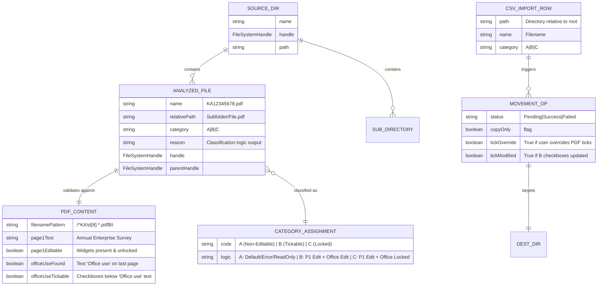
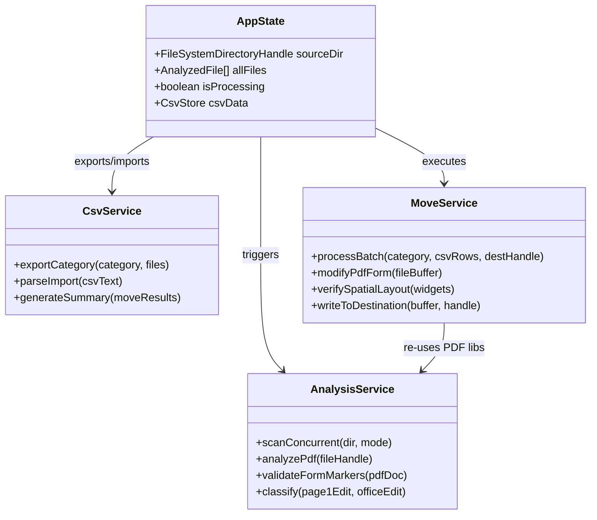
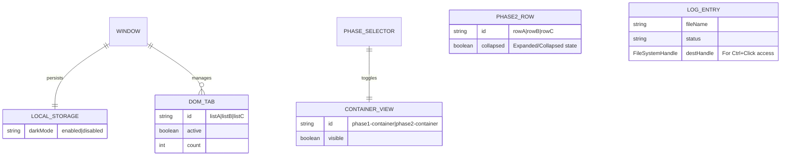

# Data Model and ERDs

This document captures the core data shapes, file system interactions, and runtime state models for the `pdf-sorter.html` application.

## 1) Runtime Data & File System ERD

This diagram represents the in-memory objects generated during the scanning (Phase 1) and moving (Phase 2) processes.

Notes:
- **Source of Truth**: The file system is the primary source. `allFiles` array is a transient snapshot.
- **Analysis Logic**:
    - **Category A**: Default state. Assigned if: regex fails, "Annual Enterprise Survey" missing, Page 1 has no editable widgets, or any error occurs.
    - **Category B**: Assigned if: Page 1 has editable widgets **AND** the "Office Use" section on the last page contains editable checkboxes.
    - **Category C**: Assigned if: Page 1 has editable widgets **BUT** the "Office Use" section is missing, invalid, or locked.
- **B-Category Modification**: When moving Category B files, the system **optionally** injects checkbox states.
    - **Default**: Retains existing PDF ticks (No modification).
    - **Override Mode**: If enabled by user, it ticks `dta` (or user selection) and unticks others based on spatial sorting of the last page's widget annotations.
- **Folder Retention**: 
    - **Category A**: Retains the original source subdirectory structure (e.g., `Source/Sub/File.pdf` -> `Dest/Sub/File.pdf`).
    - **Category B & C**: Flattens files into the destination root (e.g., `Source/Sub/File.pdf` -> `Dest/File.pdf`).

## 2) CSV I/O Data Models

### Analysis Export Schema (Output of Phase 1)
Filename: `pdf-analysis-{category}-{timestamp}.csv`

| Column | Type | Description |
| :--- | :--- | :--- |
| `FilePath` | String | The directory path relative to the source root (e.g., `Root/Subfolder`). |
| `FileName` | String | The specific PDF filename (e.g., `KA12345678.pdf`). |
| `Category` | Enum | `A`, `B`, or `C`. |
| `Reason` | String | Human-readable string explaining the classification logic. |
| `MoveStatus` | String | Static value "Pending" for template generation. |

### Move Summary Schema (Output of Phase 2)
Filename: `move-summary-{timestamp}.csv`

| Column | Type | Description |
| :--- | :--- | :--- |
| `FileName` | String | Name of the processed file. |
| `OriginalPath` | String | Source directory path. |
| `Category` | Enum | `A`, `B`, or `C`. |
| `DestinationFolder` | String | Name of the target folder selected by the user. |
| `Status` | Enum | `Success` or `Failed`. |
| `Message` | String | Detailed error message or modification log (e.g., "[Updated: 1 Checked]"). |

## 3) Service Layer Model (Logic Flow)

Notes:
- **Concurrency**: Phase 1 analysis uses a custom promise pool (limit: 8 concurrent workers) to process file reading and `pdf.js` parsing in parallel without freezing the main thread.
- **PDF Library Usage**: 
    - Phase 1 (Read-only) uses `pdf.js` for efficient text content and annotation inspection.
    - Phase 2 (Read/Write) uses `pdf-lib` to modify form fields (ticking boxes) and save the resulting binary.
- **Tick Logic Tolerance**: The `modifyPdfForm` logic uses spatial tolerance (y-diff < 10, x-sort) to identify the "Office Use" row even if visual alignment varies slightly between files.

## 4) UI State & Persistence

Notes:
- **Dark Mode**: Persisted in `localStorage` (`darkMode`). Applied via CSS root variables.
- **Phase Isolation**: The UI strictly separates Phase 1 (Analysis) and Phase 2 (Movement). Data does not automatically flow from Phase 1 to Phase 2; it MUST go through the CSV Export -> CSV Import cycle to allow human review/editing.
- **Phase 2 Collapsible Sections**: Rows A, B, and C are collapsible accordion panels. Toggling reduces visual clutter, hiding CSV controls and options while keeping the header visible. The state (expanded/collapsed) is currently transient (not persisted).
- **Log Interactivity**: Move/Copy logs retain a reference to the destination `FileSystemHandle`, enabling a "Ctrl+Click" action to instantly open the processed PDF for verification.
