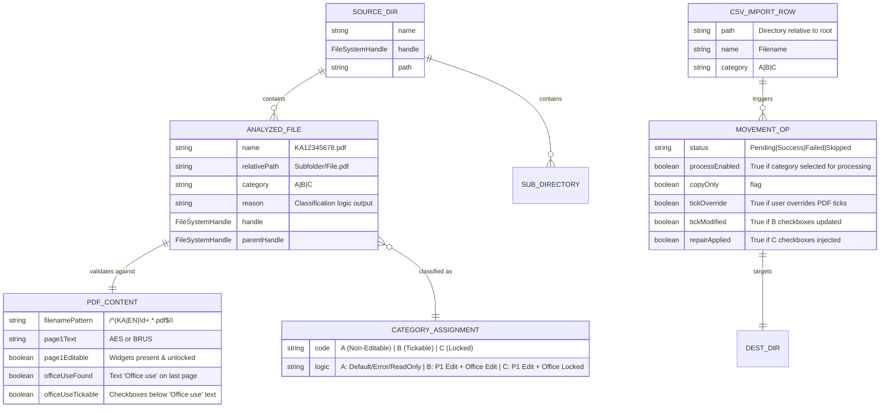
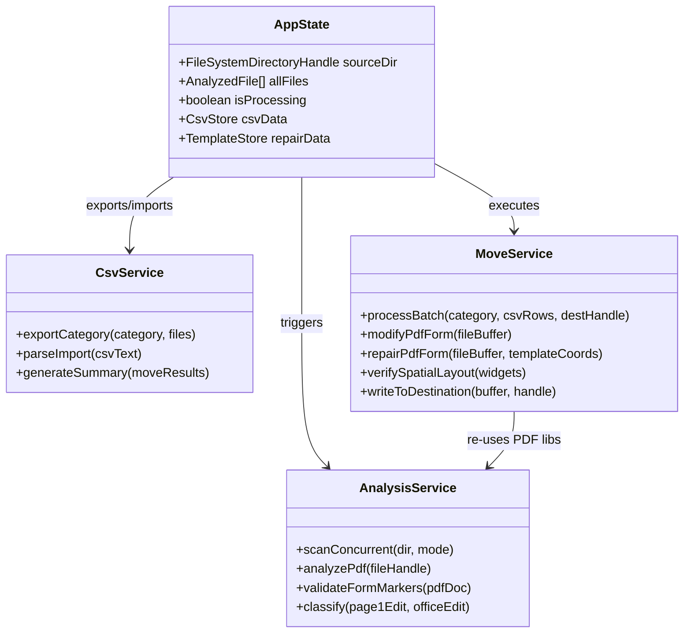
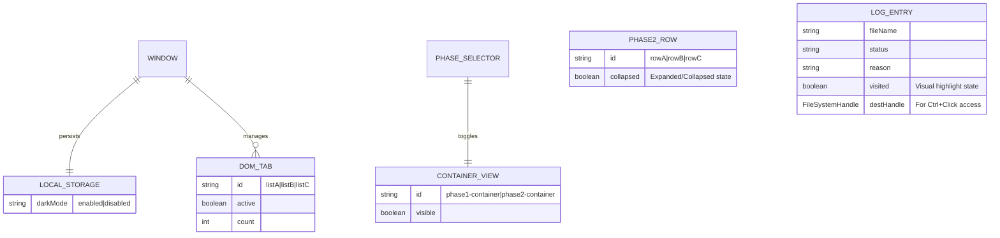

# Data Model and ERDs

This document captures the core data shapes, file system interactions, and runtime state models for the `pdf-sorter.html` application.

## 1) Runtime Data & File System ERD

This diagram represents the in-memory objects generated during the scanning (Phase 1) and moving (Phase 2) processes.

Notes:
- **Source of Truth**: The file system is the primary source. `allFiles` array is a transient snapshot.
- **Analysis Logic**:
    - **Form Support**: Explicitly supports "Annual Enterprise Survey" (AES) and "Business Register Update Survey" (BRUS).
    - **Category A**: Default state. Assigned if: regex fails, required form text missing, Page 1 has no editable widgets, or any error occurs.
    - **Category B**: Assigned if: Page 1 has editable widgets **AND** the "Office Use" section on the last page contains editable checkboxes.
    - **Category C**: Assigned if: Page 1 has editable widgets **BUT** the "Office Use" section is missing, invalid, or locked.
- **B-Category Modification**: When moving Category B files, the system **optionally** injects checkbox states.
    - **Default**: Retains existing PDF ticks (No modification).
    - **Override Mode (Force/Add)**: If enabled by user, it identifies matching rows using a spatial clustering algorithm (grouping widgets by Y-coordinate with 20pt tolerance). It then ticks selected indices (User must select; no default auto-tick is applied in Force/Add modes) and optionally unticks others based on horizontal (X) sorting within each detected row.
    - **Auto Mode**: Scans three potential trigger locations on a per-file basis:
        1. **Page 4 & 5 (Index 3 & 4)**: Checks the "Errors / omissions" column (Column 7). If text is found on either page (Page 5 logic is only triggered if the total document page count is exactly 7), it triggers a **`dta`** tick (Index 3) on the last page.
        2. **Last Page**: Checks contact fields (`ContactFirstName`, `ContactFamilyName`, `ContactPosition`, `ContactEmail`, `ContactPhone`, `ContactOtherPh`, `LogisticsFirstName`, `LogisticsLastName`, `LogisticsContactTitle`, `LogisticsContactEmail`, `LogisticsContactMobilePhone`). If text is found, it triggers an **`adr`** tick (Index 0) on the last page.
        3. **First Page**: Checks address fields (`AddAttn`, `AddLegalName`, `AddStreet1`, `AddStreet2`, `AddSuburb`, `AddCity`, `AddPostcode`). If text is found, it also triggers an **`adr`** tick (Index 0) on the last page.
        - **Execution**: Ticks (whether triggered by **Auto Mode** detection or manual **Force/Add Mode** override) are applied ONLY to the **Last Page** office-use checkboxes. If multiple triggers are met (Auto) or multiple indices are selected (Force/Add), all corresponding boxes on the last page are updated.
- **C-Category Repair**: When moving Category C files, the system **optionally** repairs non-editable "Office Use" sections.
    - **Input**: User provides a "Template PDF" (Category B) containing correct widgets.
    - **Analysis**: System extracts widget coordinates (X, Y, W, H) and names from the template.
    - **Execution**: Injects new interactive checkboxes at the template coordinates with hardcoded styling (light blue-gray background `rgb(0.9, 0.92, 0.96)`, light gray border `rgb(0.75, 0.75, 0.75)`) to match typical form appearance.
- **Selective Category Processing**: Each category (A, B, C) has a "Process" checkbox in Phase 2.
    - **Default**: Categories are **not** selected for processing (User must manually opt-in).
    - **Behavior**: Unchecking a category skips it entirely during execution (no files processed, no output folder created).
    - **Use Case**: Allows processing only Category C for repair testing without waiting for A and B.
- **Folder Structure**: 
    - **Single Destination**: User selects one root destination folder.
    - **Auto-Created Subfolders**: `Non-Editable/`, `Office Use Tickable/`, `Office Use Not Tickable/`, `Companions/` (created lazily only when needed).
    - **All Categories (A, B, C)**: KA-prefixed PDFs are flattened to their category subfolder (e.g., `Source/Sub/KA123.pdf` -> `Dest/Non-Editable/KA123.pdf`).
- **Companion Files**: Non-KA files in the same source folder as processed KA files.
    - **Optional**: User can select a "Companion Folder" destination.
    - **Structure**: Companions retain their subfolder structure (e.g., `Source/Sub/accounts.pdf` -> `Companion-Folder/Sub/accounts.pdf`).
    - **Conflict Handling**: User selects behavior when companion file already exists: Overwrite, Skip, or Ask.
    - **Copy/Move**: Companions follow the same copy/move mode as their associated KA file's category.

## 2) CSV I/O Data Models

### Analysis Export Schema (Output of Phase 1)
Filename: `pdf-analysis-{category}-{timestamp}.csv`

| Column | Type | Description |
| :--- | :--- | :--- |
| `FilePath` | String | The directory path relative to the source root (e.g., `Root/Subfolder`). |
| `FileName` | String | The specific PDF filename (e.g., `KA12345678.pdf`). |
| `Category` | Enum | `A`, `B`, or `C`. |
| `Reason` | String | Human-readable string explaining the classification logic. |
| `MoveStatus` | String | Static value "Pending" for template generation. |

*Note: Phase 2 CSV parsing now explicitly captures the `Reason` column (index 3) to display in the Move Log.*

### Move Summary Schema (Output of Phase 2)
Filename: `move-summary-{timestamp}.csv`

| Column | Type | Description |
| :--- | :--- | :--- |
| `FileName` | String | Name of the processed file. |
| `OriginalPath` | String | Source directory path. |
| `Category` | Enum | `A`, `B`, `C`, or `Companion`. |
| `DestinationFolder` | String | Name of the target folder selected by the user. |
| `Status` | Enum | `Success`, `Failed`, or `Skipped`. |
| `Message` | String | Detailed error message or modification log (e.g., "[Updated: 1 Checked]", "[Repaired]"). |

## 3) Service Layer Model (Logic Flow)

Notes:
- **Concurrency**: Phase 1 analysis uses a custom promise pool (limit: 8 concurrent workers) to process file reading and `pdf.js` parsing in parallel without freezing the main thread.
- **PDF Library Usage**: 
    - Phase 1 (Read-only) uses `pdf.js` for efficient text content and annotation inspection.
    - Phase 2 (Read/Write) uses `pdf-lib` to modify form fields (ticking boxes), inject new widgets (Repair Mode), and save the resulting binary.
- **Tick Logic Tolerance**: The `modifyPdfForm` logic uses spatial tolerance (y-diff < 10, x-sort) to identify the "Office Use" row even if visual alignment varies slightly between files.
- **Repair Logic**: The `repairPdfForm` logic relies on exact coordinate matching between a user-provided Template PDF and the target files. It uses masking (white rectangles) to hide non-editable artifacts.
- **Save Optimization (Rich Text Mitigation)**: To prevent crashes while saving forms containing unsupported "Rich Text" fields (e.g., specific BRUS form text boxes), the system disables global field appearance updates during the save process (`updateFieldAppearances: false`). It instead manually triggers updates only for the checkboxes it modifies.

## 4) UI State & Persistence

Notes:
- **Dark Mode**: Persisted in `localStorage` (`darkMode`). Applied via CSS root variables.
- **Session Persistence**: Analysis results are saved to `localStorage` (24h expiry) and restored on page reload. File handles cannot be serialized, so source/destination folders must be re-selected.
- **Phase Flow**: 
    - **Direct Flow**: "Proceed to Move" button after Phase 1 analysis switches to Phase 2 and auto-populates CSV data.
    - **Source Inheritance**: Phase 2 inherits the source folder from Phase 1 when using direct flow.
    - **Locked State**: Phase 2 controls (CSV inputs, Tick modes, Process checkboxes) remain **inactive/disabled** until BOTH a Source Folder and a Destination Folder are selected. This enforces a strict initialization workflow.
    - **CSV Override**: Users can still manually upload CSVs to override auto-populated data for human review/editing.
- **Phase 2 Collapsible Sections**: Rows A, B, and C are collapsible accordion panels. Toggling reduces visual clutter, hiding CSV controls and options while keeping the header visible. The state (expanded/collapsed) is currently transient (not persisted).
- **Log Interactivity**: Move/Copy logs retain a reference to the destination `FileSystemHandle`, enabling a "Ctrl+Click" action to instantly open the processed PDF for verification.
- **List Features**: Both Phase 1 and Phase 2 lists support:
    - **Resizing**: Vertical resize handle for better visibility.
    - **Visited State**: Visual highlighting (purple background) for opened files.
    - **Tabbed Logging**: Phase 2 results are separated into tabs (Log A, B, C) for cleaner review.
